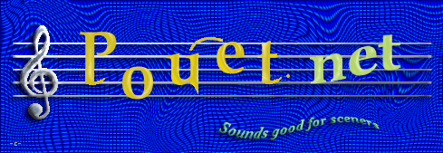

% Bytebeats
% Noah Weninger
% October 25, 2019

# Music

- Number theory shows up everywhere in music:
- Time signatures
- Scales
- Frequency relationships
- Consonance/dissonance
- **How deep does it go?**

# Digital sound

- $f:\mathbb{Z}\to\mathbb{Z}$ where $|f(t)|\le b$
- 

# Digital music

- Digital sound, but more... periodic
- 

# More digital music

- 
- ```f(t)=(t^t/4^t/32)&31```

# Wat
<iframe width="560" height="315" src="https://www.youtube.com/embed/GtQdIYUtAHg" frameborder="0" allow="accelerometer; autoplay; encrypted-media; gyroscope; picture-in-picture" allowfullscreen></iframe>

# The 2nd iteration
<iframe width="560" height="315" src="https://www.youtube.com/embed/qlrs2Vorw2Y?start=69" frameborder="0" allow="accelerometer; autoplay; encrypted-media; gyroscope; picture-in-picture" allowfullscreen></iframe>

# Why would anyone do this?
To answer this question, we need to dive into the history of computer art...

#  




# 

# 

# The backstory
"It all started a couple of months ago, when I encountered a 23-byte C-64 demo, [Wallflower](https://www.youtube.com/watch?v=7lcQ-HDepqk) by 4mat of Ate Bit, that was like nothing I had ever seen on that size class on any platform. Glitchy, yes, but it had a musical structure that vastly outgrew its size. I started to experiment on my own and came up with a 16-byte VIC-20 program whose musical output totally blew my mind." - [Viznut 2011](http://viznut.fi/texts-en/bytebeat_algorithmic_symphonies.html)

# Bytebeat album

# battle of the bits

# More examples / an online editor
[```t%(t/(t>>9|t>>13))```](https://greggman.com/downloads/examples/html5bytebeat/html5bytebeat.html#t=0&e=0&s=8000&bb=5d000001001200000000000000003a09410781d076a6638d274fcd4cd401334c6be13efffb20f000)

[```t%(t/(t>>9|t>>13))|t*((t>>9|t>>13)%16)/8```](https://greggman.com/downloads/examples/html5bytebeat/html5bytebeat.html#t=0&e=0&s=8000&bb=5d000001002800000000000000003a09410781d076a6638d274fcd4cd401334c232c9e6d4ee2f641bb2b3aca9700a0fff33a0c00)

[```((t/128)/((t/2)%(t/77&t>>14)))```](https://greggman.com/downloads/examples/html5bytebeat/html5bytebeat.html#t=0&e=0&s=44100&bb=5d000001001e00000000000000001461cc5e31197925169763d83a2fc92836b2f4fbee7b3baf844f91a0b3fffff93e0000)

[```t%(t^t/(t&t/(32<<(t>>14&7))))-t```](https://greggman.com/downloads/examples/html5bytebeat/html5bytebeat.html#t=0&e=0&s=8000&bb=5d000001001f00000000000000003a0941078359e492525d097a3ec17e1c55db099625ba53ae9857f0132660b8ffffb0b68000)

# Critique
- Okay, so this similarity between sound waves and bitwise functions is weird & cool... but lots of people don't like the music it produces.
- It actually causes some people to feel panicked and on high alert
- Recall the pervasiveness of number theory in music: **Can we use the same functions in a different way?**

# More abstraction
- We've been looking at writing out sound waves directly from our bytebeats
- But when a composer writes a song, they don't draw waveforms by hand.
- What if we write a MIDI file where the notes are decided by a bytebeat?

# MIDI bytebeat
1 hour later...  <audio controls><source src="out43.flac" type="audio/flac"></audio>
```
if t%64==0:
    s=(s>>9)|((s&((1<<11)-1))<<3)
play(0,0,toscale(s,(t//2&t//5|t//8&t//16)%36+60),t/8,1/8,127)
play(1,1,toscale(s,(t//5|t//8|t//16)%12+36),t/8,1/8,127)
```
(full code in [the repo](https://github.com/nwoeanhinnogaehr/bytebeat-udls))

# Spectral bytebeat
- Generating waveforms directly gives very "bleepy" output.
- How about using bytebeats to control the parameters of a synth?
- The "synth" of choice... fast fourier transform

# Spectral bytebeat
<audio controls><source src="knead03.mp3" type="audio/mp3"></audio>
```
int feed[2][fft_size];
void fill(cplx *buf[2], int n, double t) {
    for (int c = 0; c < 2; c++) {
        for (int i = 1; i < n; i++) {
            int r = (int)(t*12)*n/2+i+feed[c][i];
            feed[c][i] += r/16^r/63^r/1023^c;
            if (int mod = (r/16^r/65^r/1024))
                feed[c][i] %= mod;
            buf[c][i] = (exp(cplx(0.0,M_PI*
                sin(M_PI*feed[c][i]/double(n-i)))))
                /pow(i+1, 1.0)/2.0;
} } }
```
See [tinyspec](https://github.com/nwoeanhinnogaehr/tinyspec)

# Making beats


# Some theory

# Resources
[The original pouet thread](https://www.pouet.net/topic.php?which=8357&page=1)
Various online tools
IBNIZ
bytebeat in hardware
bytebeat papers
tinyspec
http://wavepot.com/
rampcode
pytebeat

# Extras

https://greggman.com/downloads/examples/html5bytebeat/html5bytebeat.html#t=0&e=0&s=32000&bb=5d000001001b0000000000000000141d01f00425d021087b406c8fc1583215ef67aaf4dbfb98cf515fff390c0000
https://greggman.com/downloads/examples/html5bytebeat/html5bytebeat.html#t=0&e=0&s=44100&bb=5d000001001e00000000000000001461cc5e31197925169763d83a2fc92836b2f4fbee7b3baf844f91a0b3fffff93e0000

